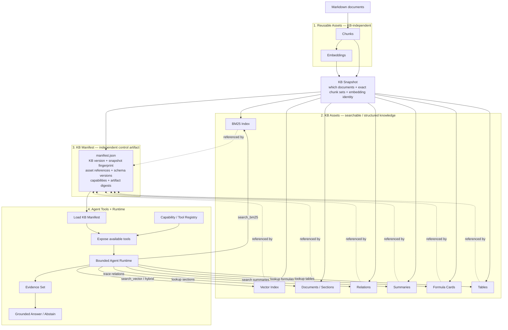
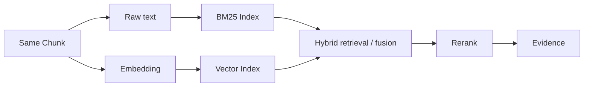
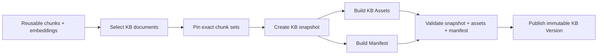
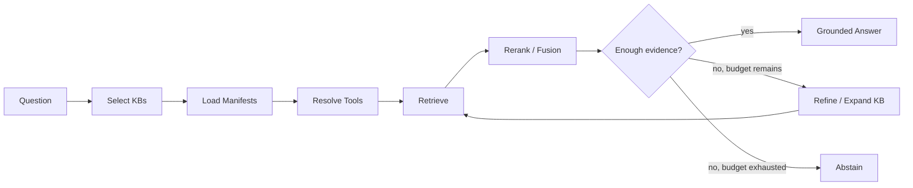

# agentic-kb-chat

`agentic-kb-chat` is a modular, evaluation-driven knowledge-base chat engine built around reusable retrieval assets, versioned knowledge bases, manifest-declared capabilities, and bounded Agentic Chat.

Markdown is the canonical source boundary. Chunking and embeddings are reusable assets: the same chunks and embeddings can be shared by multiple knowledge bases instead of being regenerated for every KB. A KB then composes those assets into its own searchable and structured knowledge package.

The project deliberately separates four layers:

1. **Reusable Assets** — chunks and embeddings that are independent of any one KB.
2. **KB Assets** — BM25/vector indexes and structured knowledge artifacts built for one KB snapshot.
3. **KB Manifest** — a separate version/identity/capability description for that KB snapshot.
4. **Agent Tools + Runtime** — a generic runtime that reads the manifest, exposes supported tools, retrieves evidence, and answers or abstains.

## Core architecture



### The important boundary between Layer 2 and Layer 3

**KB Assets and the KB Manifest are separate products of the same KB snapshot.**

Layer 2 contains the actual data structures used to retrieve or inspect knowledge:

- BM25 index for lexical search.
- Vector index for semantic search.
- Documents and sections for source resolution and citations.
- Relations for graph-like traversal.
- Optional summaries, formulas, tables, or other domain artifacts.

Layer 3 does not replace those assets and is not itself a retrieval index. The manifest identifies the exact KB version and declares which assets and capabilities are available.

A simplified package can look like:

```text
kb-build/
└── regulation/
    └── <kb-version>/
        ├── manifest.json
        ├── documents.jsonl
        ├── sections.jsonl
        ├── relations.jsonl
        ├── summaries.jsonl
        ├── formulas.jsonl
        ├── tables.jsonl
        └── indexes/
            ├── bm25/
            └── vector/
```

The assets can evolve independently. For example, rebuilding a BM25 implementation does not require regenerating embeddings, and changing a relation extractor does not require rebuilding the vector embedding asset unless the underlying chunk snapshot changes.

## What the manifest does

The manifest is the KB version's identity, inventory, and capability declaration.

Example:

```json
{
  "schema_version": 1,
  "kb_id": "regulation",
  "kb_version": "kbv_...",
  "snapshot_fingerprint": "...",
  "chunk_profile_id": "semantic-v1",
  "embedding_identity_key": "emb_...",
  "capabilities": {
    "search.lexical": true,
    "search.vector": true,
    "search.hybrid": true,
    "relations": true,
    "summaries": true,
    "formulas": false,
    "tables": false
  },
  "artifacts": {
    "documents": "documents.jsonl",
    "sections": "sections.jsonl",
    "relations": "relations.jsonl",
    "bm25_index": "indexes/bm25/",
    "vector_index": "indexes/vector/"
  },
  "artifact_digests": {
    "documents": "...",
    "sections": "...",
    "relations": "...",
    "bm25_index": "...",
    "vector_index": "..."
  }
}
```

The manifest answers questions such as:

- Which exact KB version is this?
- Which document/chunk snapshot was used?
- Which embedding identity was used for vector search?
- Which search and structured-knowledge capabilities exist?
- Where are the corresponding artifacts?
- Which schema and builder versions produced them?
- Are the artifacts intact and reproducible?

## How Layer 4 works

Layer 4 should be **manifest-driven, but not manifest-implemented**.

The Agent runtime should be generic across KBs. It reads a selected KB's manifest and exposes only the capabilities declared by that manifest. However, a manifest cannot create executable behavior by itself: every capability must have a corresponding implementation registered in the runtime.

```text
Manifest declares capability
        ↓
Capability Registry resolves implementation
        ↓
Agent receives available Tool
        ↓
Tool accesses the corresponding KB Asset
```

For example:

| Manifest capability | Runtime tool | Backing asset |
| --- | --- | --- |
| `search.lexical` | `search_bm25()` | BM25 index |
| `search.vector` | `search_vector()` | Vector index |
| `search.hybrid` | `search_hybrid()` | BM25 + vector indexes |
| `relations` | `trace_relations()` | Relations artifact |
| `summaries` | `search_summaries()` | Summary artifact |
| `formulas` | `lookup_formula()` | Formula cards |
| `tables` | `lookup_table()` | Structured tables |

This means the project should **not build a separate Agent implementation for each KB**.

A new KB normally requires only a new snapshot, assets, and manifest. A new kind of capability requires one new Tool/adapter implementation; after that, any KB can enable it through its manifest.

The intended rule is:

> **KB-specific configuration lives in the manifest. Capability-specific behavior lives in reusable tools. Agent orchestration remains generic.**

## Search model

BM25 and vector search operate over the same chunk content but use different indexes.



BM25 does not require a separate embedding. It indexes chunk text directly. Vector search uses the chunk embedding and embeds the query with the same embedding identity. Hybrid retrieval can combine both result sets before reranking.

## Reusable asset model

Chunking and embedding should be reusable across KBs.

```text
Markdown document
    ↓
immutable ChunkSet
    ↓
Chunk[]
    ↓
Embedding[chunk_id, embedding_identity]
```

A KB does not own these assets. It pins the exact assets it needs:

```text
KB Regulation ─┐
               ├── shared ChunkSet / Embeddings
KB Valuation ──┘
```

The desired identities are:

- `document_id` — stable logical document identity.
- `chunk_set_id` — one immutable chunking result for one document/content/profile combination.
- `chunk_id` — one retrieval unit inside a chunk set.
- `embedding_identity_key` — provider/model/dimension/config identity.
- `kb_id` — logical knowledge-base identity.
- `snapshot_fingerprint` — exact KB composition identity.
- `kb_version` — immutable published KB package/version.

## KB build flow

The KB build starts from reusable retrieval assets, not from regenerating them for every KB.



Layer 2 and Layer 3 are deliberately parallel here. The manifest records and validates the asset package; it is not the asset package itself.

## Agentic Chat runtime

Chat starts from ready knowledge bases, not from an unscoped global embedding collection.

A bounded runtime should follow this sequence:

1. Analyze the user question.
2. Select one or more candidate KBs from the KB registry.
3. Load the selected KB manifests.
4. Resolve the capabilities available for each KB through the Tool Registry.
5. Retrieve evidence using the appropriate tools, normally hybrid search first when available.
6. Optionally use relations or specialized tools when the question requires them.
7. Rerank, fuse, and deduplicate evidence.
8. Assess whether evidence is sufficient.
9. Within configured limits, refine the query or expand to another KB if needed.
10. Produce a grounded answer with resolvable citations, or abstain when evidence is insufficient.



The runtime is agentic because semantic decisions can choose among bounded capabilities and retrieval steps. It is not an unbounded autonomous tool loop.

## Markdown input contract

The smallest supported source is a directory of categorized Markdown files:

```text
kb-source/
├── regulation/
│   ├── document-a.md
│   └── document-b.md
├── valuation/
│   └── document-c.md
└── kb.yaml
```

Example `kb.yaml`:

```yaml
version: 1
knowledge_bases:
  - id: regulation
    name: Regulation
    documents: regulation/**/*.md
  - id: valuation
    name: Valuation
    documents: valuation/**/*.md
```

Optional front matter can provide stable metadata:

```markdown
---
document_id: document-a
title: Example Document
source_url: https://example.com/source
---

# Example Document

Document content starts here.
```

Compatible prebuilt chunk/embedding assets may be reused instead of regenerated, as long as their identities and contracts can be validated.

## Scope boundary

### In scope

- Accepting categorized Markdown and/or compatible reusable chunk/embedding assets.
- Validating document, chunk-set, embedding, KB snapshot, and manifest contracts.
- Composing multiple independent, versioned knowledge bases.
- Building KB-specific BM25/vector indexes and structured artifacts.
- Building and validating independent KB manifests.
- Manifest-driven capability exposure through reusable tools.
- Agentic KB selection and multi-KB retrieval.
- Hybrid retrieval, reranking, evidence assembly, grounded answers, citations, and abstention.
- Pluggable LLM, embedding, reranker, index, and tool adapters.
- CLI/API entry points over the same application services.
- Reproducible evaluation of routing, retrieval, tool selection, grounding, citations, and answer quality.

### Out of scope

- Crawling websites or downloading source documents.
- PDF/Word/HTML/image-to-Markdown conversion.
- OCR provider integration.
- Maintaining a general-purpose acquisition pipeline.
- Unbounded autonomous agents or multi-agent workflow orchestration.

Those concerns can live upstream. This project focuses on reusable retrieval assets, KB composition, KB capabilities, and Agentic Chat.

## Modular architecture

```text
src/
├── domain/                 # Provider-neutral identities and contracts
│   ├── documents/
│   ├── assets/
│   ├── knowledge_base/
│   └── evidence/
├── assets/                 # Chunk/embedding asset adapters and validation
├── build/
│   ├── snapshot/           # KB composition and snapshot fingerprint
│   ├── indexes/            # BM25/vector index builders
│   ├── structured/         # sections/relations/summaries/formulas/tables
│   └── manifest/           # independent manifest builder/validator
├── runtime/
│   ├── routing/            # KB selection
│   ├── capabilities/       # manifest capability resolution
│   ├── retrieval/          # search/fusion/reranking
│   ├── sufficiency/        # evidence policy
│   └── orchestration/      # bounded agent state machine
├── tools/                  # reusable capability-specific tool interfaces
├── ports/                  # LLM, embedding, reranker, index, registry contracts
├── adapters/               # provider/infrastructure implementations
├── application/            # build, publish, and chat use cases
├── api/
├── cli/
└── ui/
```

The core domain must not depend on provider SDKs. The Agent must not depend directly on FAISS files, BM25 implementation details, or raw relation storage formats; it operates through reusable tool contracts.

## Evaluation

Evaluation should measure the system at each boundary:

- **KB routing accuracy** — correct KB or KB combination selected.
- **Tool selection quality** — appropriate capability used when specialized retrieval is needed.
- **Retrieval recall** — supporting sections appear in candidates.
- **Hybrid/fusion quality** — lexical and semantic retrieval combine effectively.
- **Reranking quality** — strongest evidence reaches final context.
- **Groundedness** — answer claims are supported by retrieved evidence.
- **Citation correctness** — citations resolve to the correct document/section.
- **Abstention quality** — unsupported questions are declined.
- **Answer usefulness** — domain-review correctness, completeness, and clarity.
- **Latency and cost** — build/query time, model calls, and token usage.

Evaluation records should pin `kb_version`, `snapshot_fingerprint`, manifest schema, tool/runtime version, model configuration, and retrieval configuration so results are reproducible.

## Initial milestones

1. Freeze reusable chunk/embedding asset contracts and identity rules.
2. Define KB snapshot composition and fingerprinting.
3. Build one BM25 index and one vector index from the same pinned chunks.
4. Define the independent manifest schema and validator.
5. Implement the Capability/Tool Registry and manifest-driven tool exposure.
6. Implement bounded KB routing, hybrid retrieval, reranking, citations, and abstention.
7. Add optional relations and specialized artifacts only where evaluation demonstrates value.
8. Expose the same application services through CLI/API and add repeatable evaluation baselines.

Implementation should remain narrow: reuse proven chunk/embedding behavior where possible, keep KB assets and manifests separate, and add new capabilities only when they have a clear runtime consumer and measurable evaluation value.
