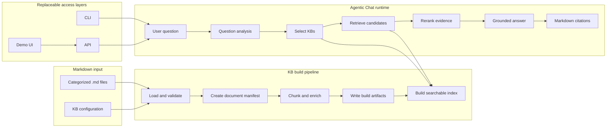

# agentic-kb-chat

`agentic-kb-chat` is a modular knowledge-base chat project that turns categorized Markdown documents into a high-quality Agentic Chat experience.

Markdown is the input boundary. The project starts with ready-to-use `.md` files and is responsible for building knowledge bases, selecting the right knowledge base at query time, retrieving evidence, and producing grounded answers with citations.

The first milestone is not to support every document format. It is to prove that a Markdown-only corpus can produce a reliable, explainable, and replaceable Agentic Chat pipeline.

## Goal

Given one or more categorized Markdown collections, the system should:

1. Build independent, versioned knowledge bases.
2. Generate the artifacts needed for retrieval and agent reasoning.
3. Select the relevant knowledge base or knowledge bases for each question.
4. Retrieve and rerank supporting passages.
5. Answer from retrieved evidence and cite the source Markdown.
6. Expose the same engine through a CLI, an API, and a demonstration UI.
7. Allow model and infrastructure components to be replaced through configuration.

## Scope boundary

### In scope

- Importing categorized Markdown files.
- Validating the minimal Markdown input contract.
- Building document manifests, chunks, summaries, relations, and indexes.
- Managing multiple independent knowledge bases.
- Agentic knowledge-base selection and multi-KB retrieval.
- Retrieval, reranking, grounded answer generation, and citations.
- Pluggable LLM, embedding, reranker, and vector-store adapters.
- CLI and API entry points over the same application services.
- A lightweight UI for demonstrating and evaluating the chat experience.
- Reproducible evaluation of routing, retrieval, grounding, citations, and answer quality.

### Out of scope

- Crawling websites or downloading source documents.
- Converting PDF, Word, HTML, or images to Markdown.
- OCR provider integration and conversion-job management.
- Comparing Markdown against an original document.
- Storing or interpreting OCR layout data, bounding boxes, confidence scores, or page images.
- Repairing source documents or maintaining a document-conversion archive.

Those concerns belong to an upstream acquisition and conversion pipeline. This project accepts the resulting Markdown as its source material.

## End-to-end flow



The build pipeline and runtime pipeline are separate. A knowledge base can be rebuilt or replaced without changing the chat orchestration, and the chat engine can switch models without changing the Markdown corpus.

## Markdown input contract

The smallest supported input is a directory of Markdown files grouped by knowledge-base category:

```text
kb-source/
├── regulation/
│   ├── document-a.md
│   └── document-b.md
├── valuation/
│   └── document-c.md
└── kb.yaml
```

Example `kb.yaml`:

```yaml
version: 1
knowledge_bases:
  - id: regulation
    name: Regulation
    documents: regulation/**/*.md
  - id: valuation
    name: Valuation
    documents: valuation/**/*.md
```

Each Markdown file is treated as an authoritative input document. Optional front matter can provide stable metadata:

```markdown
---
document_id: document-a
title: Example Document
source_url: https://example.com/source
---

# Example Document

Document content starts here.
```

Only `document_id` and content identity need to be stable. A source URL is useful for traceability but is not required for retrieval.

## Build artifacts

The builder produces a portable KB package rather than coupling the source files to a particular database:

```text
kb-build/
└── regulation/
    ├── manifest.json
    ├── documents.jsonl
    ├── chunks.jsonl
    ├── summaries.jsonl
    ├── relations.jsonl
    └── index/
```

- `manifest.json` records the KB version, configuration, document hashes, and adapter versions.
- `documents.jsonl` records document metadata and source paths.
- `chunks.jsonl` contains retrieval units with stable document and section references.
- `summaries.jsonl` contains document or section summaries used for routing and broad retrieval.
- `relations.jsonl` contains optional parent-child and cross-document relationships.
- `index/` contains an implementation-specific lexical or vector index.

Generated artifacts are disposable and reproducible. Markdown remains the source of truth; changing a chunker, embedding model, or vector store creates a new build rather than modifying the source documents.

## Modular architecture

```text
src/
├── domain/          # Provider-neutral models and contracts
├── ingest/          # Markdown loading and validation
├── build/           # Chunking, summaries, relations, manifests
├── kb/              # KB registry, versions, and index lifecycle
├── agent/           # Planning, KB routing, tool loop, answer policy
├── retrieval/       # Search, fusion, reranking, citation assembly
├── adapters/
│   ├── llm/
│   ├── embedding/
│   ├── reranker/
│   └── vector_store/
├── application/     # Build and chat use cases
├── api/             # HTTP transport
├── cli/             # Command-line transport
└── ui/              # Demonstration UI
```

The core domain must not import a provider SDK. Provider-specific behavior stays behind adapters selected by configuration.

## Pluggable execution

CLI and API commands call the same application services:

```text
CLI ─┐
     ├─> BuildKnowledgeBase ─> KB package
API ─┘

CLI ─┐
     ├─> RunAgenticChat ─> routed retrieval ─> answer
API ─┘
```

Expected configuration switches include:

```yaml
llm:
  provider: openai-compatible
  model: configured-model

embedding:
  provider: configured-provider
  model: configured-embedding-model

reranker:
  provider: configured-provider

vector_store:
  provider: local
```

Changing a provider should not change the build or chat workflow contract.

## Agentic Chat runtime

The runtime should use a bounded and observable sequence:

1. Analyze the question and determine whether retrieval is required.
2. Inspect KB descriptions and select one or more candidate KBs.
3. Run retrieval against the selected KBs.
4. Rerank and deduplicate the evidence.
5. Decide whether the evidence is sufficient.
6. If needed, refine the query or search another KB within a configured step limit.
7. Produce an answer grounded in the final evidence set.
8. Return citations that resolve to Markdown document and section identifiers.

Every step should emit structured trace data so routing mistakes, retrieval failures, and unsupported answers can be evaluated independently.

## Why Markdown-only

Rich conversion outputs are useful only when the runtime has a feature that consumes them. Page coordinates help page-level highlighting, structured tables help table-specific reasoning, and image assets help multimodal question answering. Keeping these artifacts without corresponding retrieval and answer tools does not improve a text Agentic Chat system.

The initial system therefore follows a deliberate rule:

> If a capability can be built and evaluated from Markdown, build it from Markdown first.

If a future feature requires non-Markdown information, a separate upstream component should turn it into additional Markdown or a separately defined retrieval package. That work remains outside this project's baseline and must not change the Markdown ingestion contract.

## Evaluation

The project is successful only if the resulting chat performs well on the supplied Markdown corpus. Evaluation should cover:

- **KB routing accuracy:** whether the agent selects the correct KB or KB combination.
- **Retrieval recall:** whether the supporting section appears in the retrieved candidates.
- **Reranking quality:** whether the most useful evidence reaches the final context.
- **Groundedness:** whether answer claims are supported by retrieved Markdown.
- **Citation correctness:** whether citations resolve to the supporting document and section.
- **Abstention quality:** whether the system declines unsupported questions instead of inventing an answer.
- **Answer usefulness:** domain-review scores for correctness, completeness, and clarity.
- **Latency and cost:** build time, query time, model calls, and token usage.

The evaluation set should include single-KB questions, multi-KB questions, ambiguous routing cases, formula-heavy passages, table-heavy passages, and questions that are not answered by the corpus.

## Initial milestones

1. Define Markdown and KB configuration schemas.
2. Build deterministic document, chunk, summary, and manifest artifacts.
3. Implement one local searchable index and adapter contracts.
4. Implement KB selection, retrieval, reranking, and cited answers.
5. Expose the same flow through CLI and API.
6. Add the demonstration UI and structured execution trace.
7. Create a repeatable evaluation set and publish baseline results.

Implementation should remain narrow until the Markdown-only baseline is measured. New ingestion formats or rich document features should be added only when an evaluation demonstrates that the existing pipeline cannot support a required use case.

