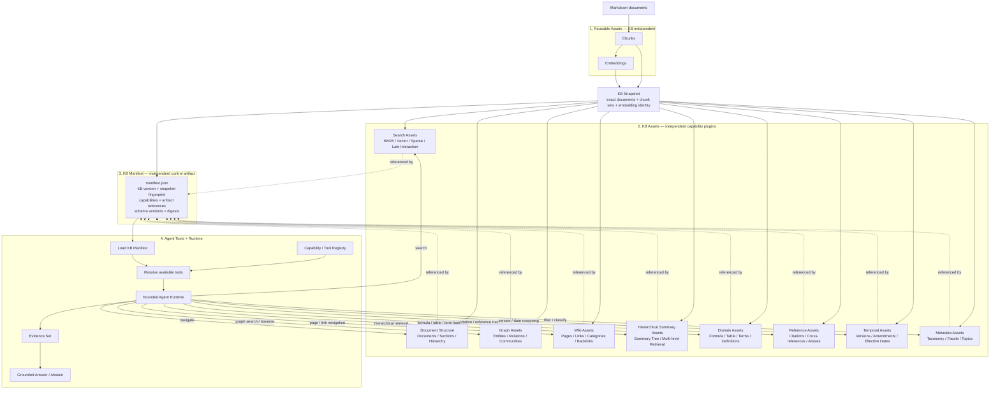
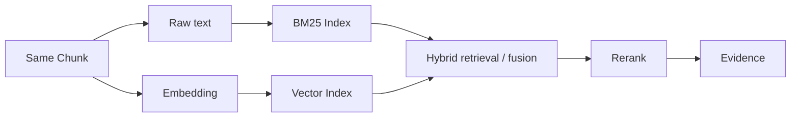
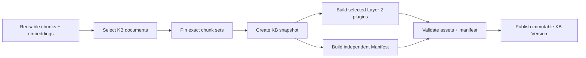
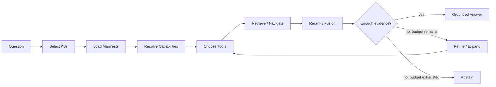

# agentic-kb-chat

`agentic-kb-chat` is a modular, evaluation-driven knowledge-base chat engine built around reusable retrieval assets, versioned knowledge bases, manifest-declared capabilities, and bounded Agentic Chat.

Markdown is the canonical source boundary. Chunking and embeddings are reusable assets: the same chunks and embeddings can be shared by multiple knowledge bases instead of being regenerated for every KB. A KB composes those reusable assets into its own searchable and structured knowledge package.

The architecture deliberately separates four layers:

1. **Reusable Assets** — chunks and embeddings that are independent of any one KB.
2. **KB Assets** — pluggable search, structure, graph, hierarchy, domain, and version-aware artifacts built for one KB snapshot.
3. **KB Manifest** — a separate version/identity/inventory/capability description for that KB snapshot.
4. **Agent Tools + Runtime** — a generic runtime that reads the manifest, exposes supported tools, retrieves evidence, and answers or abstains.

The central design rule is:

> **KB-specific configuration lives in the manifest. Capability-specific data lives in Layer 2 assets. Capability-specific behavior lives in reusable tools. Agent orchestration remains generic.**

## Core architecture



## Layer 2 is the plugin layer

Layer 2 is intentionally open-ended. It is not one fixed `ready_data` format and it is not limited to vector RAG.

A Layer 2 capability is valid when it has four things:

```text
Builder
  ↓
KB Asset
  ↓
Manifest capability declaration
  ↓
Tool Adapter
```

Once those four pieces exist, the generic runtime can use the capability without creating a new KB-specific Agent.

### A. Search assets

These answer: **which evidence is relevant to this query?**

```text
Search Assets
├── BM25 / lexical index
├── Dense vector index
├── Hybrid fusion
├── Sparse neural index
└── Late-interaction index
```

Examples of capabilities:

```text
search.lexical
search.vector
search.hybrid
search.sparse
search.late_interaction
```

BM25 uses chunk text directly. Dense vector search uses reusable embeddings. Other retrieval implementations may introduce their own derived representations while still fitting the same Layer 2 contract.

### B. Document and hierarchical structure assets

These answer: **where does this piece of evidence live in the document structure?**

```text
Document
└── Section
    ├── Section
    │   ├── Chunk
    │   └── Chunk
    └── Section
```

Possible assets include:

```text
documents
sections
heading tree
parent / child links
neighboring chunks
multi-level summaries
summary tree
```

A hierarchical summary tree can support retrieval at several abstraction levels instead of only retrieving flat chunks.

Example capabilities:

```text
structure.document
structure.section
structure.hierarchy
retrieval.hierarchical
```

### C. GraphRAG assets

These answer: **what entities exist, how are they related, and what larger themes or communities exist?**

```text
Graph Assets
├── Entities
├── Entity aliases
├── Relations
├── Communities
├── Community summaries
└── Graph index
```

This is a richer form of the simple structural `relations` artifact.

Simple relation:

```text
Document --has_section--> Section
Section  --has_formula--> Formula
```

GraphRAG-style relation:

```text
OSFI --regulates--> Insurer
LICAT --defines--> Capital Requirement
Capital Requirement --applies_to--> Insurer
```

Example capabilities:

```text
graph.entity_search
graph.relation_search
graph.traverse
graph.community_search
graph.global_summary
```

### D. Wiki-style assets

These answer: **how can the Agent navigate a curated page/link knowledge structure?**

```text
Wiki Assets
├── Pages
├── Page sections
├── Categories
├── Internal links
├── Backlinks
└── Parent / child navigation
```

Wiki structure can come directly from source structure or be generated as a derived KB view.

Example capabilities:

```text
wiki.search
wiki.page_lookup
wiki.section_lookup
wiki.follow_link
wiki.backlinks
```

Graph and Wiki assets may overlap, but they have different semantics: Graph assets model entities and semantic relations; Wiki assets model navigable knowledge pages and explicit links.

### E. Domain-specific structured assets

These answer questions that normal chunk search handles poorly.

```text
Domain Assets
├── Formula cards
├── Structured tables
├── Calculation terms
├── Definitions / glossary
├── Rules / clauses
└── Domain-specific records
```

Example capabilities:

```text
formula.lookup
table.lookup
table.query
term.lookup
definition.lookup
clause.lookup
```

The current actuarial use case naturally benefits from formulas, tables, calculation terms, definitions, and regulation clauses.

### F. Reference and citation assets

These answer: **what does this document or section explicitly reference?**

```text
Reference Assets
├── Document aliases
├── Citations
├── Cross-references
├── External identifiers
├── Standard / rule numbers
└── Source links
```

Example capabilities:

```text
reference.resolve
reference.outgoing
reference.incoming
reference.alias
```

These are particularly useful for standards, regulations, academic papers, and technical documentation.

### G. Temporal and version assets

These answer: **which rule/version was valid when, and what changed?**

```text
Temporal Assets
├── Published date
├── Effective date
├── Expiry date
├── Version lineage
├── Supersedes / superseded-by
├── Amendments
└── Change records
```

Example capabilities:

```text
temporal.as_of
temporal.latest
temporal.version_history
temporal.amendments
```

This can be important for regulation and actuarial research because the correct answer may depend on an effective date rather than only semantic similarity.

### H. Metadata, taxonomy, and facet assets

These answer: **what type of knowledge is this and how can it be filtered or routed?**

```text
Metadata Assets
├── Categories
├── Topics
├── Organizations
├── Jurisdictions
├── Document types
├── Taxonomy
└── Facets
```

Example capabilities:

```text
metadata.filter
taxonomy.navigate
topic.search
facet.search
```

These assets can support both retrieval filtering and KB routing.

## Layer 2 and Layer 3 are independent

**KB Assets and the KB Manifest are separate products of the same KB snapshot.**

Layer 2 contains actual searchable or inspectable knowledge structures. Layer 3 contains the identity and contract that describes them.

```text
                     KB Snapshot
                    /           \
                   /             \
                  ▼               ▼
          Layer 2 Assets      Layer 3 Manifest
          ──────────────      ────────────────
          BM25 index          KB/version identity
          Vector index        capability declarations
          Graph               artifact locations
          Wiki                schema versions
          Summary tree        artifact digests
          Formula/Table       builder versions
          Temporal data       compatibility contract
```

The manifest is therefore **not a retrieval index** and does not contain all knowledge relationships itself. It is the KB version's identity, inventory, capability declaration, and integrity receipt.

A package may look like:

```text
kb-build/
└── regulation/
    └── <kb-version>/
        ├── manifest.json
        ├── documents.jsonl
        ├── sections.jsonl
        ├── summaries.jsonl
        ├── graph/
        │   ├── entities.jsonl
        │   ├── relations.jsonl
        │   └── communities.jsonl
        ├── wiki/
        │   ├── pages.jsonl
        │   └── links.jsonl
        ├── domain/
        │   ├── formulas.jsonl
        │   ├── tables.jsonl
        │   └── terms.jsonl
        ├── temporal/
        │   └── versions.jsonl
        └── indexes/
            ├── bm25/
            └── vector/
```

Not every KB needs every directory. The manifest declares only the assets that actually exist.

## Manifest-driven capability discovery

Example manifest fragment:

```json
{
  "schema_version": 1,
  "kb_id": "regulation",
  "kb_version": "kbv_...",
  "snapshot_fingerprint": "...",
  "chunk_profile_id": "semantic-v1",
  "embedding_identity_key": "emb_...",
  "capabilities": {
    "search.lexical": true,
    "search.vector": true,
    "search.hybrid": true,
    "structure.section": true,
    "graph.traverse": true,
    "wiki.page_lookup": false,
    "retrieval.hierarchical": true,
    "formula.lookup": false,
    "table.query": true,
    "reference.resolve": true,
    "temporal.as_of": true,
    "metadata.filter": true
  },
  "artifacts": {
    "sections": "sections.jsonl",
    "graph": "graph/",
    "tables": "domain/tables.jsonl",
    "temporal": "temporal/versions.jsonl",
    "bm25_index": "indexes/bm25/",
    "vector_index": "indexes/vector/"
  }
}
```

The manifest tells the runtime what is available. It does not create executable behavior by itself.

```text
Manifest capability
        ↓
Capability Registry
        ↓
Tool Adapter
        ↓
Layer 2 Asset
```

Example registry:

| Manifest capability | Runtime tool | Backing asset |
| --- | --- | --- |
| `search.lexical` | `search_bm25()` | BM25 index |
| `search.vector` | `search_vector()` | Vector index |
| `search.hybrid` | `search_hybrid()` | BM25 + vector |
| `retrieval.hierarchical` | `search_hierarchy()` | Summary/tree asset |
| `graph.traverse` | `trace_graph()` | Graph asset |
| `wiki.page_lookup` | `get_wiki_page()` | Wiki asset |
| `formula.lookup` | `lookup_formula()` | Formula cards |
| `table.query` | `query_table()` | Structured tables |
| `reference.resolve` | `resolve_reference()` | Reference asset |
| `temporal.as_of` | `search_as_of()` | Temporal asset |
| `metadata.filter` | `filter_metadata()` | Metadata/facet asset |

A new KB normally requires only a new snapshot, Layer 2 assets, and manifest. A new capability type requires one builder/asset contract and one reusable Tool Adapter; after that, any KB can enable the capability through its manifest.

## Plug-in model

This architecture intentionally treats Layer 2 capabilities as plug-ins.

```text
                    Generic Core
         ┌──────────────────────────────┐
         │ KB Snapshot                  │
         │ Manifest                     │
         │ Capability Registry          │
         │ Agent Runtime                │
         │ Evidence / Citation Contract │
         └──────────────┬───────────────┘
                        │
          ┌─────────────┼─────────────┐
          ▼             ▼             ▼
      Search Plugin  Graph Plugin  Domain Plugin
          │             │             │
        BM25          GraphRAG       Formula
        Vector        Wiki           Table
        Sparse        Summary Tree   Temporal
        ColBERT       Relations      ...
```

A capability plug-in should define:

```text
1. builder contract
2. artifact schema
3. manifest capability name
4. artifact validator
5. runtime Tool interface
6. evidence/citation mapping
7. evaluation cases
```

This keeps experimental retrieval methods replaceable. The Agent does not need to know whether vector search is FAISS, Qdrant, another vector store, or a late-interaction retriever; it only consumes the registered capability contract.

## Search model

BM25 and vector search can operate over the same chunks while maintaining different indexes.



BM25 does not need a separate embedding. Vector search embeds the query with the same embedding identity used for the indexed chunks. Hybrid retrieval combines multiple result sets before reranking.

Alternative search plugins such as sparse neural retrieval or late-interaction retrieval may build their own KB-specific representations while preserving the same evidence output contract.

## Reusable asset model

Chunking and standard dense embeddings should be reusable across KBs.

```text
Markdown document
    ↓
immutable ChunkSet
    ↓
Chunk[]
    ↓
Embedding[chunk_id, embedding_identity]
```

A KB pins the exact reusable assets it needs:

```text
KB Regulation ─┐
               ├── shared ChunkSet / Embeddings
KB Valuation ──┘
```

Core identities:

- `document_id` — stable logical document identity.
- `chunk_set_id` — one immutable chunking result for one document/content/profile combination.
- `chunk_id` — one retrieval unit inside a chunk set.
- `embedding_identity_key` — provider/model/dimension/config identity.
- `kb_id` — logical knowledge-base identity.
- `snapshot_fingerprint` — exact KB composition identity.
- `kb_version` — immutable published KB package/version.

## KB build flow

KB build starts from reusable retrieval assets rather than regenerating chunks and embeddings for each KB.



Layer 2 and Layer 3 are parallel outputs. Rebuilding one Layer 2 plugin does not automatically require rebuilding unrelated plugins. The manifest changes when the published KB package or capability inventory changes.

## Agentic Chat runtime

Chat starts from ready KB versions rather than an unscoped global embedding collection.

1. Analyze the question.
2. Select one or more candidate KBs from the KB registry.
3. Load selected KB manifests.
4. Resolve available capabilities through the Capability/Tool Registry.
5. Choose the appropriate retrieval/navigation tools.
6. Retrieve evidence.
7. Rerank, fuse, and deduplicate evidence where appropriate.
8. Use graph/wiki/hierarchy/domain/temporal tools when the question needs them.
9. Assess whether the evidence is sufficient.
10. Within configured limits, refine the query or expand to another KB.
11. Produce a grounded answer with resolvable citations, or abstain.



The runtime is agentic because it chooses among bounded capabilities and retrieval paths. It is not an unbounded autonomous tool loop.

## Markdown input contract

The smallest supported source is categorized Markdown:

```text
kb-source/
├── regulation/
│   ├── document-a.md
│   └── document-b.md
├── valuation/
│   └── document-c.md
└── kb.yaml
```

Example:

```yaml
version: 1
knowledge_bases:
  - id: regulation
    name: Regulation
    documents: regulation/**/*.md
  - id: valuation
    name: Valuation
    documents: valuation/**/*.md
```

Optional front matter can provide stable metadata:

```markdown
---
document_id: document-a
title: Example Document
source_url: https://example.com/source
---

# Example Document

Document content starts here.
```

Compatible prebuilt chunk/embedding assets may be reused instead of regenerated when their identities and contracts can be validated.

## Scope boundary

### In scope

- Accepting categorized Markdown and/or compatible reusable chunk/embedding assets.
- Validating document, chunk-set, embedding, KB snapshot, Layer 2 asset, and manifest contracts.
- Composing independent, versioned knowledge bases.
- Pluggable Layer 2 builders for search, graph, hierarchy, wiki, domain, reference, temporal, and metadata capabilities.
- Independent KB manifest build and validation.
- Manifest-driven capability exposure through reusable tools.
- Agentic KB selection and multi-KB retrieval.
- Fusion, reranking, evidence assembly, grounded answers, citations, and abstention.
- Pluggable LLM, embedding, reranker, index, asset-builder, and tool adapters.
- CLI/API entry points over shared application services.
- Reproducible evaluation of routing, retrieval, tool selection, grounding, citations, and answer quality.

### Out of scope

- Crawling websites or downloading source documents.
- PDF/Word/HTML/image-to-Markdown conversion.
- OCR provider integration.
- Maintaining a general-purpose acquisition pipeline.
- Unbounded autonomous agents or multi-agent workflow orchestration.

Upstream systems may provide Markdown and reusable retrieval assets. This project focuses on KB composition, pluggable KB capabilities, manifests, and Agentic Chat.

## Modular architecture

```text
src/
├── domain/                    # Stable provider-neutral contracts
│   ├── documents/
│   ├── assets/
│   ├── knowledge_base/
│   └── evidence/
├── assets/                    # Reusable chunk/embedding validation
├── build/
│   ├── snapshot/              # KB composition + fingerprint
│   ├── plugins/               # Layer 2 builder plugins
│   │   ├── search/
│   │   ├── graph/
│   │   ├── hierarchy/
│   │   ├── wiki/
│   │   ├── domain/
│   │   ├── reference/
│   │   ├── temporal/
│   │   └── metadata/
│   └── manifest/              # Independent manifest builder/validator
├── runtime/
│   ├── routing/               # KB selection
│   ├── capabilities/          # Manifest capability resolution
│   ├── retrieval/             # Search/fusion/reranking
│   ├── sufficiency/           # Evidence policy
│   └── orchestration/         # Bounded Agent state machine
├── tools/                     # Reusable capability Tool Adapters
├── ports/                     # LLM/embedding/reranker/index/registry contracts
├── adapters/                  # Provider/infrastructure implementations
├── application/               # Build/publish/chat use cases
├── api/
├── cli/
└── ui/
```

The Agent must not depend directly on FAISS files, a BM25 library, graph storage, or raw JSON formats. It operates through stable capability and evidence contracts.

## Evaluation

Evaluation should measure every boundary:

- **KB routing accuracy** — correct KB or KB combination.
- **Tool selection quality** — appropriate capability chosen.
- **Retrieval recall** — supporting evidence appears in candidates.
- **Fusion quality** — multiple retrieval signals combine effectively.
- **Graph/hierarchy navigation quality** — multi-hop or global questions reach supporting evidence.
- **Temporal correctness** — time/version-sensitive questions use the correct source version.
- **Reranking quality** — strongest evidence reaches final context.
- **Groundedness** — answer claims are supported.
- **Citation correctness** — citations resolve to the correct source.
- **Abstention quality** — unsupported questions are declined.
- **Answer usefulness** — domain correctness, completeness, and clarity.
- **Latency and cost** — build/query time, model calls, storage, and token usage.

Evaluation records should pin `kb_version`, `snapshot_fingerprint`, manifest schema, plugin versions, tool/runtime versions, model configuration, and retrieval configuration.

## Initial milestones

1. Freeze reusable chunk/embedding asset contracts and identity rules.
2. Define KB snapshot composition and fingerprinting.
3. Define the Layer 2 plugin contract: builder, artifact schema, validator, capability name, Tool Adapter, evidence mapping, evaluation.
4. Implement BM25 and dense vector search plugins over the same pinned chunks.
5. Define the independent manifest schema and validator.
6. Implement the Capability/Tool Registry and manifest-driven tool exposure.
7. Implement bounded KB routing, hybrid retrieval, reranking, citations, and abstention.
8. Add graph, hierarchy, wiki, domain, temporal, or other plugins only when they have a clear runtime consumer and measurable evaluation value.
9. Expose the same application services through CLI/API and publish repeatable evaluation baselines.

Implementation should remain narrow at first, but the architecture must stay open: **Layer 2 is the extension point; Layer 3 describes what is installed; Layer 4 discovers and uses it.**
