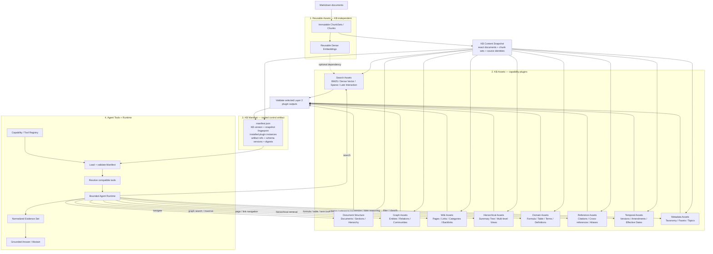
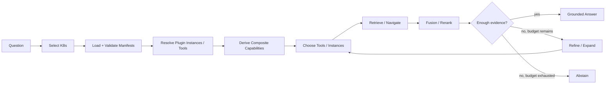

# agentic-kb-chat

`agentic-kb-chat` is a modular, evaluation-driven knowledge-base chat engine built around reusable content assets, pluggable KB capabilities, sealed manifests, and a bounded Agentic Chat runtime.

Markdown is the canonical **document/content provenance boundary**. KB configuration and manifests are control metadata rather than source documents. Chunk sets and reusable representations such as dense embeddings may be prepared once and shared by multiple knowledge bases. A KB then pins an exact content snapshot and installs only the Layer 2 capability plugins it needs.

The architecture deliberately separates four layers:

1. **Reusable Assets** — KB-independent document/chunk assets and reusable representations.
2. **KB Assets / Plugins** — KB-specific searchable or structured artifacts built from one content snapshot.
3. **KB Manifest** — the sealed identity, inventory, compatibility contract, and integrity receipt for one published KB version.
4. **Agent Tools + Runtime** — a generic runtime that discovers compatible capabilities, retrieves evidence, and answers or abstains.

The central design rule is:

> **KB-specific configuration lives in the manifest. Capability-specific data lives in Layer 2 assets. Capability-specific behavior lives in reusable tools. Agent orchestration remains generic.**

## Core architecture



## The four boundaries

### Layer 1 — reusable assets

Layer 1 contains assets that can be reused by many KBs.

```text
Markdown document
    ↓
immutable ChunkSet
    ↓
Chunk[]
    └── optional reusable representations
        └── DenseEmbedding[chunk_id, embedding_identity]
```

The important rule is that a KB does not own the chunking result or a standard dense embedding. It pins the exact immutable assets it wants to use.

```text
KB Regulation ─┐
               ├── shared ChunkSet / Dense Embeddings
KB Valuation ──┘
```

Core reusable identities include:

- `document_id` — stable logical document identity.
- `chunk_set_id` — one immutable chunking result for one document/content/profile combination.
- `chunk_id` — one retrieval unit inside a chunk set.
- `embedding_identity_key` — one reusable dense embedding representation identity.

Not every Layer 2 search plugin must use the reusable dense embedding. Sparse or late-interaction plugins may build their own representations and record those dependencies in their own plugin contract.

### KB Content Snapshot — representation-neutral composition

Before Layer 2 is built, the KB pins its exact content composition.

```text
KB Content Snapshot
├── kb_id
├── document identities / source versions
├── exact chunk_set_ids
└── snapshot_fingerprint
```

The snapshot is deliberately **representation-neutral**. It does not require one global embedding identity because one KB may install multiple search plugins, including multiple dense-vector indexes built from different embedding identities.

This separates two questions:

```text
KB Snapshot:  "What content is in this KB version?"
Layer 2:      "What representations and capabilities were built over it?"
```

### Layer 2 — the plugin layer

Layer 2 is the extension point of the system. It contains persisted, searchable, navigable, or structured KB artifacts.

A canonical Layer 2 plugin contract has seven required pieces:

```text
1. Builder contract
2. Artifact schema
3. Manifest capability declaration
4. Artifact validator
5. Runtime Tool Adapter
6. Evidence / citation mapping
7. Evaluation coverage
```

The simplified lifecycle is:

```text
Builder
  ↓
KB Asset
  ↓
Validator
  ↓
Manifest records installed plugin instance
  ↓
Tool Adapter exposes its capabilities
  ↓
Normalized Evidence
```

A new KB does not need a new Agent. A new capability type needs one reusable plugin implementation; after that, any compatible KB can install it.

### Layer 3 — sealed KB manifest

Layer 2 assets and the Layer 3 manifest are **different artifact types and different contracts**, but a final manifest is not built independently of the assets it seals.

The order is:

```text
KB Content Snapshot
       ↓
Build/reuse selected Layer 2 plugin artifacts
       ↓
Validate plugin artifacts
       ↓
Seal manifest with exact plugin instances, versions, schemas, refs and digests
       ↓
Validate complete KB package
       ↓
Publish immutable KB Version
```

So "Layer 2 and Layer 3 are independent" means:

- the manifest is not a retrieval index;
- Layer 2 artifacts have their own schemas and lifecycles;
- one Layer 2 plugin can be rebuilt/replaced without redesigning unrelated plugins or the Agent;
- unchanged immutable plugin artifacts may be reused by a new KB build;
- any published change to the installed plugin inventory or artifact digests is sealed into a new KB version.

It does **not** mean the final manifest can be sealed before the Layer 2 outputs it references exist.

### Layer 4 — generic runtime and composition

Layer 4 contains executable behavior.

The runtime reads the sealed manifest, validates that every enabled capability has a compatible registered Tool Adapter, and exposes only those tools to the bounded Agent runtime.

```text
Manifest plugin instance / capability
        ↓
Capability Registry
        ↓
Compatible Tool Adapter
        ↓
Layer 2 Asset
        ↓
Normalized Evidence
```

If an enabled capability has no compatible Tool Adapter or the artifact/schema version is unsupported, that KB version is not runtime-ready. The system should fail clearly rather than silently dropping the capability.

When several plugin instances expose the same capability, the registry resolves all compatible instances and runtime policy decides which instance or combination to use.

## Layer 2 plugin families

Layer 2 is intentionally open-ended. The following are plugin families, not a mandatory package that every KB must build.

### A. Search assets

These answer: **which evidence is relevant to this query?**

```text
Search Assets
├── BM25 / lexical index
├── Dense vector index
├── Sparse neural index
└── Late-interaction index
```

Example persisted-plugin capabilities:

```text
search.lexical
search.vector
search.sparse
search.late_interaction
```

BM25 indexes chunk text directly and needs no embedding. Dense vector search can reuse Layer 1 dense embeddings. Sparse and late-interaction plugins may build their own KB-specific representations.

**Hybrid search, fusion, and reranking are normally Layer 4 runtime behaviors, not Layer 2 assets.** A runtime may expose `search.hybrid` when compatible lexical/vector search tools are available and the configured composition policy supports fusion.

```text
BM25 Tool ─────┐
               ├── Runtime fusion → Rerank → Evidence
Vector Tool ───┘
```

If a future fusion method produces a persisted learned index/model that is part of the KB package, that persisted object may itself be modeled as a Layer 2 plugin artifact.

### B. Document and hierarchy assets

These answer: **where does evidence live in the source structure?**

```text
Document
└── Section
    ├── Section
    │   ├── Chunk
    │   └── Chunk
    └── Section
```

Possible artifacts:

```text
documents
sections
heading tree
parent / child links
neighbor links
multi-level summaries
summary tree
```

Example capabilities:

```text
structure.document
structure.section
structure.hierarchy
retrieval.hierarchical
```

A hierarchical summary/tree plugin can retrieve at several abstraction levels instead of only searching flat chunks.

### C. GraphRAG assets

These answer: **what entities exist, how are they related, and what larger themes or communities exist?**

```text
Graph Assets
├── Entities
├── Entity aliases
├── Relations
├── Communities
├── Community summaries
└── Graph index
```

Simple structural relations:

```text
Document --has_section--> Section
Section  --has_formula--> Formula
```

GraphRAG-style semantic relations:

```text
OSFI --regulates--> Insurer
LICAT --defines--> Capital Requirement
Capital Requirement --applies_to--> Insurer
```

Example capabilities:

```text
graph.entity_search
graph.relation_search
graph.traverse
graph.community_search
graph.global_summary
```

### D. Wiki-style assets

These answer: **how can the Agent navigate a page/link knowledge structure?**

```text
Wiki Assets
├── Pages
├── Page sections
├── Categories
├── Internal links
├── Backlinks
└── Parent / child navigation
```

Example capabilities:

```text
wiki.search
wiki.page_lookup
wiki.section_lookup
wiki.follow_link
wiki.backlinks
```

Graph and Wiki assets can overlap but have different semantics: Graph assets model entities and semantic relations; Wiki assets model navigable knowledge pages and explicit links.

### E. Domain-specific structured assets

These support questions that flat chunk retrieval handles poorly.

```text
Domain Assets
├── Formula cards
├── Structured tables
├── Calculation terms
├── Definitions / glossary
├── Rules / clauses
└── Domain-specific records
```

Example capabilities:

```text
formula.lookup
table.lookup
table.query
term.lookup
definition.lookup
clause.lookup
```

The actuarial/regulation use case naturally benefits from formulas, tables, calculation terms, definitions, and clauses.

### F. Reference and citation assets

These answer: **what does this document or section explicitly reference?**

```text
Reference Assets
├── Document aliases
├── Citations
├── Cross-references
├── External identifiers
├── Standard / rule numbers
└── Source links
```

Example capabilities:

```text
reference.resolve
reference.outgoing
reference.incoming
reference.alias
```

### G. Temporal and version assets

These answer: **which rule/version was valid when, and what changed?**

```text
Temporal Assets
├── Published date
├── Effective date
├── Expiry date
├── Version lineage
├── Supersedes / superseded-by
├── Amendments
└── Change records
```

Example capabilities:

```text
temporal.as_of
temporal.latest
temporal.version_history
temporal.amendments
```

### H. Metadata, taxonomy, and facet assets

These answer: **what type of knowledge is this and how can it be filtered or routed?**

```text
Metadata Assets
├── Categories
├── Topics
├── Organizations
├── Jurisdictions
├── Document types
├── Taxonomy
└── Facets
```

Example capabilities:

```text
metadata.filter
taxonomy.navigate
topic.search
facet.search
```

These assets can support retrieval filters and KB routing profiles.

## Manifest contract

A manifest describes the exact published KB package. It records installed **plugin instances**, not only flat capability booleans.

`plugin_id` identifies the reusable plugin type. `instance_id` uniquely identifies one installed instance inside a KB version. This allows the same plugin type to be installed more than once with different models, representations, parameters, or purposes.

Example:

```json
{
  "schema_version": 1,
  "kb_id": "regulation",
  "kb_version": "kbv_...",
  "snapshot_fingerprint": "snap_...",
  "plugins": [
    {
      "plugin_id": "search.bm25",
      "instance_id": "bm25.default",
      "plugin_version": "1",
      "artifact_schema_version": "1",
      "capabilities": ["search.lexical"],
      "dependencies": {
        "snapshot_fingerprint": "snap_..."
      },
      "artifacts": [
        {
          "name": "index",
          "path": "plugins/bm25.default/index/",
          "digest": "sha256:..."
        }
      ]
    },
    {
      "plugin_id": "search.dense-vector",
      "instance_id": "vector.primary",
      "plugin_version": "1",
      "artifact_schema_version": "1",
      "capabilities": ["search.vector"],
      "dependencies": {
        "snapshot_fingerprint": "snap_...",
        "embedding_identity_key": "emb_primary_..."
      },
      "artifacts": [
        {
          "name": "index",
          "path": "plugins/vector.primary/index/",
          "digest": "sha256:..."
        }
      ]
    },
    {
      "plugin_id": "search.dense-vector",
      "instance_id": "vector.experimental",
      "plugin_version": "1",
      "artifact_schema_version": "1",
      "capabilities": ["search.vector"],
      "dependencies": {
        "snapshot_fingerprint": "snap_...",
        "embedding_identity_key": "emb_experimental_..."
      },
      "artifacts": [
        {
          "name": "index",
          "path": "plugins/vector.experimental/index/",
          "digest": "sha256:..."
        }
      ]
    },
    {
      "plugin_id": "graph.entity-relations",
      "instance_id": "graph.default",
      "plugin_version": "1",
      "artifact_schema_version": "1",
      "capabilities": ["graph.entity_search", "graph.traverse"],
      "dependencies": {
        "snapshot_fingerprint": "snap_..."
      },
      "artifacts": [
        {
          "name": "graph",
          "path": "plugins/graph.default/graph/",
          "digest": "sha256:..."
        }
      ]
    }
  ]
}
```

This supports several important cases cleanly:

- one KB can contain BM25 plus multiple vector indexes;
- the same vector plugin type can be installed multiple times with different embedding identities;
- Graph/Wiki/Formula/etc. can evolve independently;
- runtime compatibility can be checked by `plugin_id`, plugin version, artifact schema version, and capability;
- `instance_id` gives runtime traces and evidence an unambiguous source;
- artifact integrity can be verified by digest.

Capabilities are what Layer 4 consumes. Plugin/instance identities and artifact metadata are how Layer 3 proves where those capabilities came from.

## Capability Registry and composite runtime capabilities

The Tool Registry maps manifest plugin instances and capabilities to reusable Tool Adapters.

| Manifest capability | Runtime tool | Backing Layer 2 asset |
| --- | --- | --- |
| `search.lexical` | `search_bm25()` | BM25 plugin instance |
| `search.vector` | `search_vector()` | vector-search plugin instance(s) |
| `search.sparse` | `search_sparse()` | sparse-search plugin instance |
| `search.late_interaction` | `search_late_interaction()` | late-interaction plugin instance |
| `retrieval.hierarchical` | `search_hierarchy()` | summary/tree plugin instance |
| `graph.traverse` | `trace_graph()` | graph plugin instance |
| `wiki.page_lookup` | `get_wiki_page()` | wiki plugin instance |
| `formula.lookup` | `lookup_formula()` | formula plugin instance |
| `table.query` | `query_table()` | table plugin instance |
| `reference.resolve` | `resolve_reference()` | reference plugin instance |
| `temporal.as_of` | `search_as_of()` | temporal plugin instance |
| `metadata.filter` | `filter_metadata()` | metadata plugin instance |

Layer 4 may also expose **composite capabilities** that do not correspond to one persisted plugin artifact.

For example:

```text
search.lexical instance + selected search.vector instance(s)
                         ↓
Runtime composition policy
                         ↓
search.hybrid
                         ↓
fusion → rerank → EvidenceSet
```

This preserves the data/behavior boundary: Layer 2 stores search assets; Layer 4 decides which compatible instances to call and how to combine them.

## Package layout

A published KB version may look like:

```text
kb-build/
└── regulation/
    └── <kb-version>/
        ├── manifest.json
        ├── snapshot.json
        └── plugins/
            ├── bm25.default/
            │   └── index/
            ├── vector.primary/
            │   └── index/
            ├── vector.experimental/
            │   └── index/
            ├── structure.sections/
            │   └── sections.jsonl
            ├── graph.default/
            │   ├── entities.jsonl
            │   ├── relations.jsonl
            │   └── communities.jsonl
            ├── wiki.pages/
            │   ├── pages.jsonl
            │   └── links.jsonl
            ├── domain.formula/
            │   └── formulas.jsonl
            └── temporal.versions/
                └── versions.jsonl
```

Not every KB installs every plugin. The manifest lists only the plugin instances that are part of that immutable KB version.

## KB build and publish flow

```mermaid
flowchart LR
    ASSET[Reusable document / chunk assets]
    SELECT[Select KB documents]
    PIN[Pin exact ChunkSets]
    SNAP[Create representation-neutral content snapshot]
    BUILD[Build or reuse selected Layer 2 plugins]
    PVALID[Validate plugin artifacts]
    SEAL[Seal Manifest with instances / versions / schemas / digests]
    KVALID[Validate complete KB package]
    PUBLISH[Publish immutable KB Version]

    ASSET --> SELECT --> PIN --> SNAP --> BUILD --> PVALID --> SEAL --> KVALID --> PUBLISH
```



A builder may execute independent Layer 2 plugins in parallel internally, but the **sealed** manifest is created after the selected plugin outputs have been validated.

## KB registry and Agentic Chat runtime

Chat starts from ready KB versions, not from an unscoped global embedding collection.

A small KB registry should contain enough information to route before loading a full manifest, for example:

```text
KB Registry Entry
├── kb_id
├── name / description
├── routing profile / topics
├── active kb_version
└── manifest reference
```

Runtime sequence:

1. Analyze the question.
2. Select one or more candidate KBs from the registry.
3. Load and validate the selected KB manifests.
4. Resolve compatible tools for each installed plugin instance/capability.
5. Derive any allowed composite runtime capabilities, such as hybrid search.
6. Choose the appropriate plugin instances and search/navigation tools.
7. Retrieve evidence.
8. Fuse/rerank/deduplicate where appropriate.
9. Use graph/wiki/hierarchy/domain/reference/temporal tools when needed.
10. Assess whether evidence is sufficient.
11. Within configured limits, refine the query or expand to another KB.
12. Produce a grounded answer with resolvable citations, or abstain.



The runtime is agentic because it chooses among bounded capabilities, plugin instances, and retrieval paths. It is not an unbounded autonomous tool loop.

## Evidence and citation contract

Every Tool Adapter must normalize its result into the same evidence contract so heterogeneous plugins can be fused and evaluated.

A minimal evidence item should be able to identify:

```text
Evidence
├── kb_id / kb_version
├── plugin_id / instance_id / capability
├── document_id
├── section_id (when available)
├── chunk_id or structured-record id
├── text / structured payload
├── retrieval / relevance scores
└── source citation identity
```

The Agent should reason over normalized evidence rather than raw FAISS rows, BM25 internals, graph-store records, or plugin-specific JSON.

## Markdown input contract

The smallest supported source content is categorized Markdown plus KB control configuration:

```text
kb-source/
├── regulation/
│   ├── document-a.md
│   └── document-b.md
├── valuation/
│   └── document-c.md
└── kb.yaml
```

Example:

```yaml
version: 1
knowledge_bases:
  - id: regulation
    name: Regulation
    documents: regulation/**/*.md
  - id: valuation
    name: Valuation
    documents: valuation/**/*.md
```

Optional front matter can provide stable metadata:

```markdown
---
document_id: document-a
title: Example Document
source_url: https://example.com/source
---

# Example Document

Document content starts here.
```

Compatible prebuilt chunk/representation assets may be reused instead of regenerated when their identities, provenance, and contracts can be validated.

## Scope boundary

### In scope

- Accepting categorized Markdown and/or compatible reusable chunk/representation assets.
- Validating document, ChunkSet, representation, KB snapshot, Layer 2 plugin, and manifest contracts.
- Composing independent, versioned knowledge bases.
- Pluggable Layer 2 builders for search, graph, hierarchy, wiki, domain, reference, temporal, and metadata capabilities.
- Sealed KB manifest build and validation.
- Manifest-driven capability exposure through reusable tools.
- Agentic KB selection and multi-KB retrieval.
- Runtime composition such as hybrid fusion and reranking.
- Evidence assembly, grounded answers, citations, and abstention.
- Pluggable LLM, embedding, reranker, index, asset-builder, and Tool Adapters.
- CLI/API entry points over shared application services.
- Reproducible evaluation of routing, retrieval, tool selection, grounding, citations, and answer quality.

### Out of scope

- Crawling websites or downloading source documents.
- PDF/Word/HTML/image-to-Markdown conversion.
- OCR provider integration.
- Maintaining a general-purpose acquisition pipeline.
- Unbounded autonomous agents or multi-agent workflow orchestration.

Upstream systems may provide Markdown and reusable assets. This project focuses on KB composition, pluggable KB capabilities, sealed manifests, and Agentic Chat.

## Proposed modular architecture

The repository is currently design-first; the following `src/` tree is the **target implementation layout**, not a claim that these directories already exist.

```text
src/
├── domain/                    # Stable provider-neutral contracts
│   ├── documents/
│   ├── assets/
│   ├── knowledge_base/
│   └── evidence/
├── assets/                    # Reusable ChunkSet/representation validation
├── build/
│   ├── snapshot/              # Representation-neutral KB content snapshot
│   ├── plugins/               # Layer 2 builder plugins
│   │   ├── search/
│   │   ├── graph/
│   │   ├── hierarchy/
│   │   ├── wiki/
│   │   ├── domain/
│   │   ├── reference/
│   │   ├── temporal/
│   │   └── metadata/
│   └── manifest/              # Seal/validate KB manifest after plugin validation
├── runtime/
│   ├── routing/               # KB selection
│   ├── capabilities/          # Manifest compatibility + Tool resolution
│   ├── retrieval/             # Runtime fusion/reranking/composition
│   ├── sufficiency/           # Evidence policy
│   └── orchestration/         # Bounded Agent state machine
├── tools/                     # Reusable capability Tool Adapters
├── ports/                     # LLM/embedding/reranker/index/registry contracts
├── adapters/                  # Provider/infrastructure implementations
├── application/               # Build/publish/chat use cases
├── api/
├── cli/
└── ui/
```

The Agent must not depend directly on FAISS files, a BM25 library, graph storage, or raw plugin formats. It operates through stable capability and evidence contracts.

## Evaluation

Evaluation should measure every boundary:

- **KB routing accuracy** — correct KB or KB combination.
- **Manifest/runtime compatibility** — installed capabilities resolve to compatible tools and plugin instances.
- **Tool/instance selection quality** — appropriate capability and plugin instance chosen.
- **Retrieval recall** — supporting evidence appears in candidates.
- **Fusion/reranking quality** — multiple retrieval signals combine effectively.
- **Graph/hierarchy navigation quality** — multi-hop or global questions reach supporting evidence.
- **Temporal correctness** — time/version-sensitive questions use the correct source version.
- **Groundedness** — answer claims are supported.
- **Citation correctness** — citations resolve to the correct source.
- **Abstention quality** — unsupported questions are declined.
- **Answer usefulness** — domain correctness, completeness, and clarity.
- **Latency and cost** — build/query time, model calls, storage, and token usage.

Evaluation records should pin `kb_version`, `snapshot_fingerprint`, manifest schema version, plugin IDs/instance IDs/versions/schema versions/digests, Tool/runtime versions, model configuration, and retrieval composition policy.

## Initial milestones

1. Freeze reusable ChunkSet and dense-embedding identity contracts.
2. Define a representation-neutral KB content snapshot and fingerprint.
3. Define the canonical seven-part Layer 2 plugin contract.
4. Implement BM25 and one dense-vector search plugin over the same pinned chunks.
5. Define the sealed manifest schema with plugin type/instance/version/schema/dependency/artifact-digest records.
6. Implement Manifest validation and the Capability/Tool Registry, including hard failure for unsupported installed capabilities.
7. Implement bounded KB routing plus Layer 4 hybrid fusion/reranking, citations, and abstention.
8. Add graph, hierarchy, wiki, domain, reference, temporal, sparse, or late-interaction plugins only when they have a clear runtime consumer and measurable evaluation value.
9. Expose the same application services through CLI/API and publish repeatable evaluation baselines.

Implementation should remain narrow at first, but the architecture must stay open:

> **Layer 2 is the extension point; Layer 3 seals exactly what is installed; Layer 4 discovers compatible plugin instances and composes them at runtime.**
